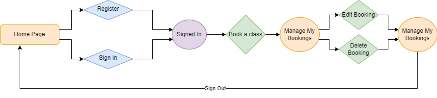
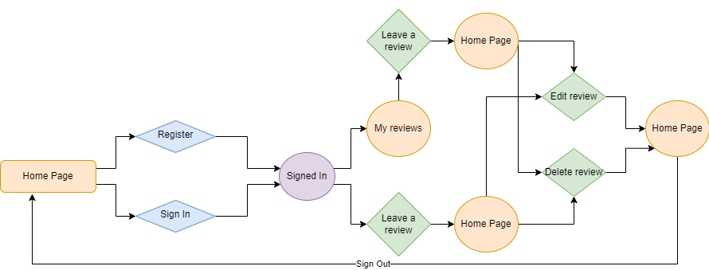

# Tango Tennis
Tango Tennis is a website for a fictional tennis club offering beginners, intermediate and advanced tennis lessons for all adults. The website is a booking site for users to book and manage classes of their choosing at times that suits them. It also allows users to write reviews of their classes so general users can see feedback about the club.
## Table of Contents
1. [UX](#ux)
    - [Project Goals](#project-goals)
    - [User Stories](#user-stories)
    - [Development Planes](#development-planes)
        - [Strategy Plane](#strategy-plane)
        - [Scope Plane](#scope-plane)
        - [Structure Plane](#structure-plane)
        - [Skeleton Plane](#skeleton-plane)
        - [Surface Plane](#surface-plane)
2. [Features](#features)
    - [Site Features](#site-features)
    - [Features Left to Implement](#features-left-to-implement)
3. [Testing](#testing)
    - [Testing Features](#testing-features)
    - [Testing User Stories](#testing-user-stories)
    - [Responsiveness](#responsiveness)
    - [Browser Compatability](#browser-compatability)
    - [Lighthouse Testing](#lighthouse-testing)
    - [Code Validation](#code-validation)
    - [Bugs](#bugs)
4. [Deployment](#deployment)
    - [Heroku Deployment](#heroku-deployment)
    - [Forking the Project](#forking-the-project)
    - [Cloning the Project](#cloning-the-project)
5. [Technologies Used](#technologies-used)
    - [Technologies](#technologies)
    - [Python Modules Used](#python-modules-used)
    - [External Python Modules](#external-python-modules)
6. [Credits](#credits)
## UX
### Project Goals
The main goal of this project is to provide an intuitive and interactive website for users to create, view, edit and delete their bookings for various tennis lessons and to allow them to do the same with any reviews they choose to write.
### User Stories
User stories for this project were broken down in to the following epics:

EPIC: Booking classes
- As a registered user I want to be able to book a class, so that I can be added to the tennis lesson
- As a registered user I want to be able to view all of my booked classes, so that I can amend them if necessary
- As a registered user I want to be able to edit my booked classes, so that I can amend them if necessary
- As a registered user I want to be able to delete my booked classes, if I can no longer attend
- As a registered user I want to receive feedback when creating, editing or deleting a class, so that I can clearly see what I have done

EPIC: Registration and User Accounts
- As a new user, I want to navigate to the sign up page, so that I can create an account
- As a registered user, I want to login to my account, so that I can make and update bookings
- As a registered user, I want to log out of my account, so that I can protect my information from being accessed by others
- *As a registered user, I want to be able to edit my account details, so that I can make changes if needed* - could have
- *As a registered user, I want to be able to delete my account, if I no longer want to be signed up to Tango Tennis* - could have

EPIC: Viewing the features of Tango Tennis
- As a general user, I want to see clearly laid out information about Tango Tennis, so that I can see what they have to offer
- As a general user, I want to see a clearly structured navbar and footer, so that I can see what will be featured on the site and can access Tango Tennis' social media links easily
- As a general user, I want the website to be responsive, so that I can access it on a range of devices
- *As a general user, I want to have access to Tango Tennis' contact information, so that I can pass on any queries I have* - could have

EPIC: Reviewing classes
- As a registered user, I want to be able to review my classes, so that I can give feedback
- As a general user, I want to be able to see reviews for the different classes and coaches, so that I can see which are rated highly
- As a registered user, I want to be able to edit my reviews, so that I can make any adjustments if needed
- As a registered user, I want to be able to delete my reviews, if I no longer want to leave that review.

EPIC: Administrative Managing of Classes
- As an admin member, I want to create tennis for the different levels, so that I can provide a clear timetable of our classes
- As an admin member, I want to view how many people have booked classes, and the dates and times of bookings, so that I can keep track of all upcoming bookings
- As an admin member, I want to be able to edit the lesson timetables, so that I can update them as necessary
- As an admin member, I want to be able to delete lessons, so that I can they do not appear in the timetable when the timetable needs to change

### Development Planes
#### Strategy Plane
The Strategy Plane deals with who this site is built for and addresses their goals and needs.

The webiste will focus on the following target audiences:
- **Roles:**
    - Adults wanting tennis lessons (either beginners, intermediate or advanced players)
    - New users (non-registered)
    - Returning users (registered)
- **Demographics:**
    - Passion for tennis
    - Desire to learn how to play (for beginners)
    - Desire to improve or advance their game (for intermediate/advanced players)
    - Adults only
- **Psychographics:**
    - Personality & Attitudes:
        - Sporty
        - Social
        - Energetic
    - Values:
        - Community
        - Healthy lifestyle
        - Keen learner
    - Lifestyles:
        - Friendly competitive
        - Active
        - Sports interest

The website needs to enable the **user** to:
- Register/login to account
- View the timetables for the different classes (beginner, intermediate, advanced)
- Book a class by selecting:
    - Which level
    - Day
    - Time
- Edit/delete their bookings
- Add a review
- Edit/delete their reviews

The website needs to enable the **client** to:
- Login to admin account
- Keep track of upcoming bookings:
    - How many people have booked classes
    - Dates and times of bookings
- Edit and update class timetables
- Manage user reviews

#### Scope Plane
The Scope Plane details what needs to be included in the site to correspond with the strategised features listed above.

**Content Requirements:**
- The user will be looking for:
    - Customisable account
        - Custom username/password
        - Make, edit and delete bookings
        - Make, edit and delete reviews
    - Easy to navigate website
    - Homepage explaining site
    - Aesthetic theme (colour palette, typography, images)

**Functionality Requirements:**
- The user will be able to:
    - Access the website on a range of devices (from 320px upwards)
    - Have the ability to create, read, update and delete bookings
    - Have the ability to create, read, update and delete reviews
    - Register/login to account
    - Access social media pages that open in separate tabs
#### Structure Plane
The Structure Plane demonstrates how the information on the site will be structured.
- The following flowchart illustrates the information architecture for booking a class:

- The following flowchart illustrates the information architecture for leaving a review:

#### Skeleton Plane
The Skeleton Plane shows what the site will look like. Balsamic wireframes have been used to demonstrate this.
#### Surface Plane
The Surface Plane demonstrates what the site will look like in greater depth by focusing on the finer details, such as the colour scheme and typography.
## Features
### Site Features
### Features Left to Implement
## Testing
### Testing Features
### Testing User Stories
### Responsiveness
### Browser Compatability
### Lighthouse Testing
### Code Validation
### Bugs
## Deployment
### Heroku Deployment
- This game was deployed to Heroku. The steps to do this are as follows:
    - Create an account with [Heroku](https://id.heroku.com/login).
    - On the Heroku dashboard, click the button that says "New", then click "Create new app".
    - Choose a unique name for the app.
    - Select your region, then click "Create app".
    -  Click on the "Settings" button on the menu.
    - Scroll down to the section "Config Vars" and click "Reveal Config Vars".
    - Add the following Config Vars:
        - CLOUDINARY_URL: The URL from your Cloudinary dashboard
        - DATABASE_URL: The URL from your ElephantSQL dashboard
        - PORT: 8000
        - SECRET_KEY: Your Secret Key
    - Go to the "Deploy" button on the menu at the top.
    - Select GitHub as the deployment method and click the "Connect to GitHub" button.
    - Search for the repository "tango-tennis" and then click "Connect".
    - Scroll to the bottom of the page and either click "Enable Automatic Deploys" in the Automatic deploys section or "Deploy branch" in the Manual deploy section.
### Forking the Project
- Follow the steps below to fork this project,:
    - Locate the hangman repository: https://github.com/s-batish/tango-tennis
    - Click the 'Fork' button at the top right of the page.
### Cloning the Project
- Follow the steps below to clone this project:
    - Locate the hangman repository: https://github.com/s-batish/tango-tennis
    - Click the green 'Code' button.
    - Copy the URL for the repository.
    - Open the repository and open a new terminal.
    - Change the current directory to the location that you want the cloned directory to be.
    - Type 'git clone' and paste the copied URL.
    - Press 'enter' to create the clone.
## Technologies Used
### Technologies
- HTML
    - Used to create the structure of the website
- CSS
    - Used to implement additional styling across the website
- JavaScript
    - Used to set the timeout for the messages
- Python
    - Used for the application of the Django framework
- Django
    - Main framework used to build the website
- Bootstrap
    - Used to implement main styling across the website
- Gitpod
    - Used to develop and edit the code
- Git
    - Used to add, commit and push the code
- GitHub
    - Used to store and deploy the code
- [Balsamiq](https://balsamiq.com/)
    - Used to create wireframes
- [Lucidchart](https://www.lucidchart.com/)
    - Used to make the database diagrams
- [Cloudinary](https://cloudinary.com/)
    - Used to store the images used on the website
- [Google Fonts](https://fonts.google.com/)
    - Used to import fonts
- [Font Awesome](https://fontawesome.com/icons)
    - Used icons from this website for the social media icons
- [Fontjoy](https://fontjoy.com/)
    - Used to create the font pairings used on the website
- [TinyPNG](https://tinypng.com/)
    - Used to reduce the size of the images used on the website
- [Favicon](https://favicon.io/)
    - Used to create a favicon
### Python Modules Used
- Django class based views (CreateView, ListView, DeleteView, UpdateView)
    - Used to apply create, read, update and delete functionalities
- Mixins (LoginRequiredMixin, UserPassesTestMixin)
    - Used to ensure user is logged in to access certain views and tests whether they are authorised to access these views
- Messages
    - Used to post success messages for certain user actions
- Timedelta and date
    - Used to get today's date and edit which dates can be booked
### External Python Modules
- Django==3.2.20
    - Main framework used for the website
- django-allauth==0.54.0
    - Used for site authentication for sign in, login and logout
- cloudinary==1.33.0
    - Used to store images
- dj3-cloudinary-storage==0.0.6
    - Cloudinary library needed to run Cloudinary
- urllib3==1.26.15
    - Cloudinary library needed to run Cloudinary
- dj-database-url==0.5.0
    - Library needed for PostgreSQL
- psycopg2==2.9.6
    - Used to connect to PostgreSQL
## Credits