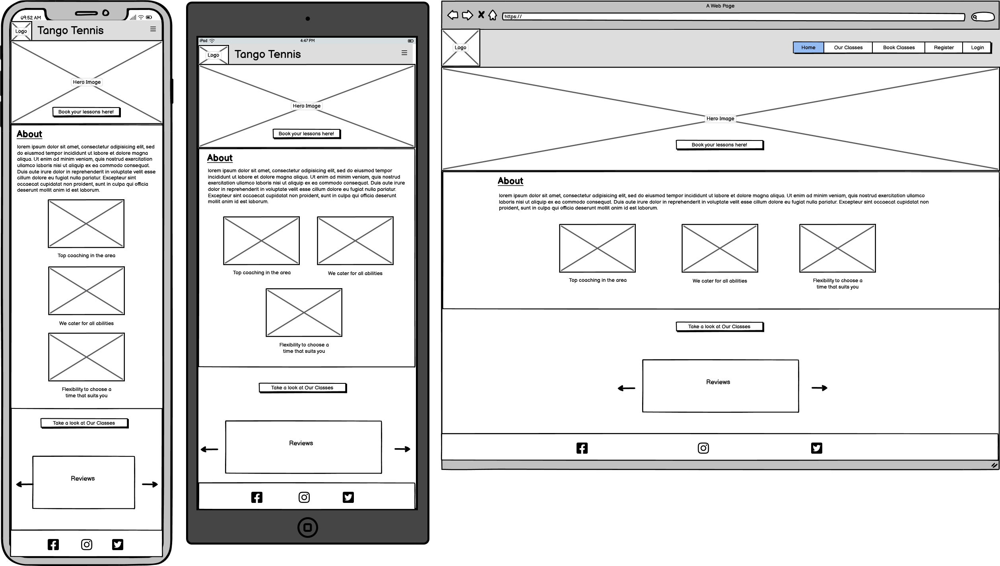
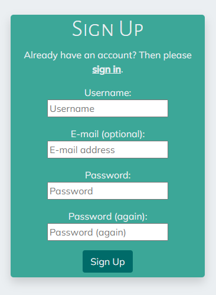
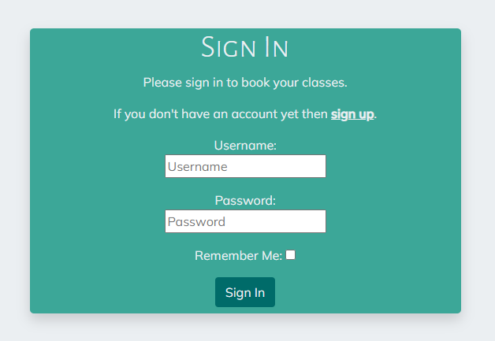
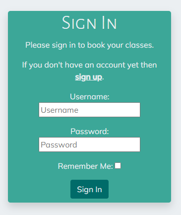
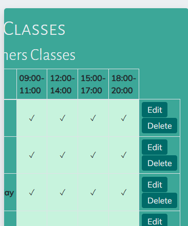

# Tango Tennis
Tango Tennis is a website for a fictional tennis club offering beginners, intermediate and advanced tennis lessons for all adults. The website is a booking site for users to book and manage classes of their choosing at times that suits them. It also allows users to write reviews of their classes so general users can see feedback about the club.
## Table of Contents
1. [UX](#ux)
    - [Project Goals](#project-goals)
    - [User Stories](#user-stories)
    - [Development Planes](#development-planes)
        - [Strategy Plane](#strategy-plane)
        - [Scope Plane](#scope-plane)
        - [Structure Plane](#structure-plane)
        - [Skeleton Plane](#skeleton-plane)
        - [Surface Plane](#surface-plane)
2. [Features](#features)
    - [Site Features](#site-features)
    - [Features Left to Implement](#features-left-to-implement)
3. [Testing](#testing)
    - [Testing Features](#testing-features)
    - [Testing User Stories](#testing-user-stories)
    - [Responsiveness](#responsiveness)
    - [Browser Compatability](#browser-compatability)
    - [Lighthouse Testing](#lighthouse-testing)
    - [Code Validation](#code-validation)
    - [Bugs](#bugs)
4. [Deployment](#deployment)
    - [Heroku Deployment](#heroku-deployment)
    - [Forking the Project](#forking-the-project)
    - [Cloning the Project](#cloning-the-project)
5. [Technologies Used](#technologies-used)
    - [Technologies](#technologies)
    - [Python Modules Used](#python-modules-used)
    - [External Python Modules](#external-python-modules)
6. [Credits](#credits)
## UX
### Project Goals
The main goal of this project is to provide an intuitive and interactive website for users to create, view, edit and delete their bookings for various tennis lessons and to allow them to do the same with any reviews they choose to write.
### User Stories
User stories for this project were broken down in to the following epics:

EPIC: Booking classes
- As a registered user I want to be able to book a class, so that I can be added to the tennis lesson
- As a registered user I want to be able to view all of my booked classes, so that I can amend them if necessary
- As a registered user I want to be able to edit my booked classes, so that I can amend them if necessary
- As a registered user I want to be able to delete my booked classes, if I can no longer attend
- As a registered user I want to receive feedback when creating, editing or deleting a class, so that I can clearly see what I have done

EPIC: Registration and User Accounts
- As a new user, I want to navigate to the sign up page, so that I can create an account
- As a registered user, I want to login to my account, so that I can make and update bookings
- As a registered user, I want to log out of my account, so that I can protect my information from being accessed by others
- *As a registered user, I want to be able to edit my account details, so that I can make changes if needed* - could have
- *As a registered user, I want to be able to delete my account, if I no longer want to be signed up to Tango Tennis* - could have

EPIC: Viewing the features of Tango Tennis
- As a general user, I want to see clearly laid out information about Tango Tennis, so that I can see what they have to offer
- As a general user, I want to see a clearly structured navbar and footer, so that I can see what will be featured on the site and can access Tango Tennis' social media links easily
- As a general user, I want the website to be responsive, so that I can access it on a range of devices
- *As a general user, I want to have access to Tango Tennis' contact information, so that I can pass on any queries I have* - could have

EPIC: Reviewing classes
- As a registered user, I want to be able to review my classes, so that I can give feedback
- As a general user, I want to be able to see reviews for the different classes and coaches, so that I can see which are rated highly
- As a registered user, I want to be able to edit my reviews, so that I can make any adjustments if needed
- As a registered user, I want to be able to delete my reviews, if I no longer want to leave that review.

EPIC: Administrative Managing of Classes
- As an admin member, I want to create tennis for the different levels, so that I can provide a clear timetable of our classes
- As an admin member, I want to view how many people have booked classes, and the dates and times of bookings, so that I can keep track of all upcoming bookings
- As an admin member, I want to be able to edit the lesson timetables, so that I can update them as necessary
- As an admin member, I want to be able to delete lessons, so that I can they do not appear in the timetable when the timetable needs to change

### Development Planes
#### Strategy Plane
The Strategy Plane deals with who this site is built for and addresses their goals and needs.

The webiste will focus on the following target audiences:
- **Roles:**
    - Adults wanting tennis lessons (either beginners, intermediate or advanced players)
    - New users (non-registered)
    - Returning users (registered)
- **Demographics:**
    - Passion for tennis
    - Desire to learn how to play (for beginners)
    - Desire to improve or advance their game (for intermediate/advanced players)
    - Adults only
- **Psychographics:**
    - Personality & Attitudes:
        - Sporty
        - Social
        - Energetic
    - Values:
        - Community
        - Healthy lifestyle
        - Keen learner
    - Lifestyles:
        - Friendly competitive
        - Active
        - Sports interest

The website needs to enable the **user** to:
- Register/login to account
- View the timetables for the different classes (beginner, intermediate, advanced)
- Book a class by selecting:
    - Which level
    - Day
    - Time
- Edit/delete their bookings
- Add a review
- Edit/delete their reviews

The website needs to enable the **client** to:
- Login to admin account
- Keep track of upcoming bookings:
    - How many people have booked classes
    - Dates and times of bookings
- Edit and update class timetables
- Manage user reviews

#### Scope Plane
The Scope Plane details what needs to be included in the site to correspond with the strategised features listed above.

**Content Requirements:**
- The user will be looking for:
    - Customisable account
        - Custom username/password
        - Make, edit and delete bookings
        - Make, edit and delete reviews
    - Easy to navigate website
    - Homepage explaining site
    - Aesthetic theme (colour palette, typography, images)

**Functionality Requirements:**
- The user will be able to:
    - Access the website on a range of devices (from 320px upwards)
    - Have the ability to create, read, update and delete bookings
    - Have the ability to create, read, update and delete reviews
    - Register/login to account
    - Access social media pages that open in separate tabs
#### Structure Plane
The Structure Plane demonstrates how the information on the site will be structured.
- The following flowchart illustrates the information architecture for booking a class:

- The following flowchart illustrates the information architecture for leaving a review:

#### Skeleton Plane
The Skeleton Plane shows what the site will look like. Balsamic wireframes have been used to demonstrate this.

- Wireframes for general users

Home page

Our Classes page

 

- Wireframes for new users

Signup page

 

- Wireframes for existing users

Login page

Booking page

Manage Bookings page

Edit booking page

Delete booking page

Add review page

My reviews page

Edit review page

Delete review page

 

- Wireframes for staff members

Add lessons page

Edit lessons page

Delete lessons page

 

- **Database Design**

An Entity Relationship Diagram has been created with Lucidchart to show the various models created for this website and how they are connected. 
- The User Model, created through Django All-Auth, is the principle model as it connects to the other models through primary/foreign key relationships.
- The Booking Model uses the id from the User Model to allow an authenticated user to book a class.
- The reviews model similarly uses the id from the User Model to allow authenticated users to leave reviews.
- Finally, the Lessons model staff ids from the User Model to enable staff members to create the lesson timetables.

#### Surface Plane
The Surface Plane demonstrates what the site will look like in greater depth by focusing on the finer details, such as the colour scheme and typography.

- **Colour Scheme**

The colour scheme for this project is as follows:

It is based on a teal colour palette which has been chosen match the site logo and the green hues associated with tennis.

- **Typography**

The font for the h1 headings is Alegreya Sans SC, with Alegreya Sans being used for the other headings and Mulish being used as the main body font throughout the site.

- **Imagery**
    - The logo was created through Shopify's online logo maker
    - The hero image, and the first and third home page card images were sourced from Unsplash, while the second home page card image was sourced from Pexels 

## Features
### Site Features
#### Features visible to a general user
***Home page***
- Both the header and footer will be shown on every page of the website, regardless of whether the user is registered or not. 
- The below headers show what a general unregistered or non-logged in user will see as there are links to register or sign in.

Desktop header

Mobile header

- The footers are the same to all users and show the three social media links for the website, which will open in new tabs when clicked.

Desktop footer

Mobile footer

- The hero image features a button that will either take the user to the login page if they are not currently signed in, or if they are signed in already it will take them to the Book Classes page

Desktop hero image

Mobile hero image

- The About sections details information about what Tango Tennis offers, with more detailing information split up into 3 cards.
- Below this, there is a button that takes the user to the Our Classes page so they can see they class timetables.

Desktop About section

Mobile About section

- At the bottom of the Home page thereis a section displaying the reviews that members have written.
- The reviews appear on a carousel so the user can click the arrows to read them all.
- Signed in users will see the button underneath allowing them to leave a review, but this will not be visible to non-logged in users.

Desktop reviews

Mobile reviews

- Signed in users will also have the option to edit or delete their reviews, but again this will not be visible to users who are not logged in or for users who did not write that review.

Reviews edit/delete buttons

 

***Our Classes page***
- This page shows the class timetables for beginners, intermediate and advanced lessons.

Desktop Our Classes page

Mobile Our Classes page

 

***Sign up page***
- This page allows unregistered users to sign up to Tango Tennis to be able to book their classes and leave reviews.

Desktop Signup page

Mobile Signup page

 

***Sign in page***
- This page allows registered users to sign in to their accounts to be able to book classes and leave reviews

Desktop Sign In page

Mobile Sign In page

 

***404 page***
- This page displays whenever a user directs to a broken link.
- It has a return Home button that takes the user back to the Home page.

Desktop 404 page

Mobile 404 page

 

***403 page***
- This page displays whenever a user attempts to access a page that they do not have permission for.
- It has a Home button that takes the user back to the Home page.

Desktop 403 page

Mobile 403 page

#### Features visible to a registered user
***Book a Class page***
- This page allows registered users to a book a class.
- They can choose the level and time but selecting from the drop down lists, and they can choose the date they would like their class to be on by using the date picker.
- If they pick either today's date or a date in the past, they will be informed that you can only pick future dates.
- If they pick a date, time and level that has already been booked, they will be informed of this and required to choose another date, time or level.
- Users will also see green messages for successfully completing actions such as signing in, signing out, or creating, updating or deleting a booking or review.
    - For example, the success message can be seen below for successfully signing in.

Desktop Book a Class page

Mobile Book a Class page

 

***Manage Bookings page***
- This page allows signed in users to see all of their bookings and to edit or delete them from here.
- Also, once the user makes their booking, they will be immediately redirected to this page.

Desktop Manage Bookings page

Mobile Manage Bookings page

 

***Edit Bookings page***
- This page allows signed in users to edit their booked class.
- If they decide not to edit it anymore, pressing the Cancel button will take them back to the Manage Bookings page.

Desktop Edit Booking page

Mobile Edit Booking page

 

***Delete Bookings page***
- This page allows signed in users to delete their booked class.
- The delete confirmation page shows them exactly which class they will be deleting.
- If they decide not to delete it anymore, pressing the Cancel button will take them back to the Manage Bookings page.

Desktop Delete Booking page

Mobile Delete Booking page

 

***My Reviews page***
- This page allows signed in users to view, edit and delete their reviews.
- They can also leave a review here by clicking on the Leave a review button.

Desktop My Reviews page

Mobile My Reviews page

 

***Edit Reviews page***
- This page allows signed in users to edit their reviews.
- If they decide not to edit it anymore, pressing the Cancel button will take them back to the My Reviews page.

Desktop Edit Reviews page

Mobile Edit Reviews page

 

***Delete Review page***
- This page allows signed in users to delete their reviews.
- The delete confirmation page shows them exactly which review they will be deleting.
- If they decide not to delete it anymore, pressing the Cancel button will take them back to the My Reviews page.

Desktop Delete Review page

Mobile Delete Review page

 

***Sign Out page***
- This page allows signed in users to log out.

Desktop Sign Out page

Mobile Sign Out page

#### Features visible to a staff member
***Create Lessons Page***
- This page allows staff members to add lessons to the class timetable.
- They can choose the level and day of the class by selecting from the dropdown options, and they can choose how often the class will run that day by selecting the checkbox options.

Desktop Add Lesson page

Mobile Add Lesson page

 

***View Lessons Page***
- This page is similar to the Our Classes page, but for staff members there is an extra column with edit and delete buttons to amend the timetable.
- On mobile devices the staff member can scroll across the timetable to view these buttons.

Desktop View Classes page

Mobile View Classes page

 

***Edit Lesson page***
- This page allows staff members to edit the lessons in the Our Classes timetable.
- If they decide not to edit it anymore, pressing the Cancel button will take them back to the View Classes page.

Desktop Edit Classes page

Mobile Edit Classes page

 

***Delete Lesson page***
- This page allows staff members to delete the lessons in the Our Classes timetable.
- If they decide not to edit it anymore, pressing the Cancel button will take them back to the View Classes page.

Desktop Delete Classes page

Mobile Delete Classes page

 

***Staff Manage Bookings page***
- This page allows staff members to see all bookings that have been made.
- They can see the booking references and also the usernames of the clients who booked the classes.
- They also have the ability to edit or delete any of the bookings.

Desktop Staff Manage Bookings page

Mobile Staff Manage Bookings page

 

***Staff My Reviews page***
- This page allows staff members to see all reviews that have been written.
- They can see the usernames of the clients who wrote the reviews.
- They also have the ability to edit or delete any of the reviews.

Desktop Staff My Reviews page

Mobile Staff My Reviews page

### Features Left to Implement
## Testing
### Testing Features
### Testing User Stories
### Responsiveness
### Browser Compatability
### Lighthouse Testing
### Code Validation
### Bugs
## Deployment
### Heroku Deployment
- This game was deployed to Heroku. The steps to do this are as follows:
    - Create an account with [Heroku](https://id.heroku.com/login).
    - On the Heroku dashboard, click the button that says "New", then click "Create new app".
    - Choose a unique name for the app.
    - Select your region, then click "Create app".
    -  Click on the "Settings" button on the menu.
    - Scroll down to the section "Config Vars" and click "Reveal Config Vars".
    - Add the following Config Vars:
        - CLOUDINARY_URL: The URL from your Cloudinary dashboard
        - DATABASE_URL: The URL from your ElephantSQL dashboard
        - PORT: 8000
        - SECRET_KEY: Your Secret Key
    - Go to the "Deploy" button on the menu at the top.
    - Select GitHub as the deployment method and click the "Connect to GitHub" button.
    - Search for the repository "tango-tennis" and then click "Connect".
    - Scroll to the bottom of the page and either click "Enable Automatic Deploys" in the Automatic deploys section or "Deploy branch" in the Manual deploy section.
### Forking the Project
- Follow the steps below to fork this project,:
    - Locate the hangman repository: https://github.com/s-batish/tango-tennis
    - Click the 'Fork' button at the top right of the page.
### Cloning the Project
- Follow the steps below to clone this project:
    - Locate the hangman repository: https://github.com/s-batish/tango-tennis
    - Click the green 'Code' button.
    - Copy the URL for the repository.
    - Open the repository and open a new terminal.
    - Change the current directory to the location that you want the cloned directory to be.
    - Type 'git clone' and paste the copied URL.
    - Press 'enter' to create the clone.
## Technologies Used
### Technologies
- HTML
    - Used to create the structure of the website
- CSS
    - Used to implement additional styling across the website
- JavaScript
    - Used to set the timeout for the messages
- Python
    - Used for the application of the Django framework
- Django
    - Main framework used to build the website
- Bootstrap
    - Used to implement main styling across the website
- Gitpod
    - Used to develop and edit the code
- Git
    - Used to add, commit and push the code
- GitHub
    - Used to store and deploy the code
- [Balsamiq](https://balsamiq.com/)
    - Used to create wireframes
- [Lucidchart](https://www.lucidchart.com/)
    - Used to make the database diagrams
- [Cloudinary](https://cloudinary.com/)
    - Used to store the images used on the website
- [Google Fonts](https://fonts.google.com/)
    - Used to import fonts
- [Font Awesome](https://fontawesome.com/icons)
    - Used icons from this website for the social media icons
- [Fontjoy](https://fontjoy.com/)
    - Used to create the font pairings used on the website
- [TinyPNG](https://tinypng.com/)
    - Used to reduce the size of the images used on the website
- [Favicon](https://favicon.io/)
    - Used to create a favicon
### Python Modules Used
- Django class based views (CreateView, ListView, DeleteView, UpdateView)
    - Used to apply create, read, update and delete functionalities
- Mixins (LoginRequiredMixin, UserPassesTestMixin)
    - Used to ensure user is logged in to access certain views and tests whether they are authorised to access these views
- Messages
    - Used to post success messages for certain user actions
- Timedelta and date
    - Used to get today's date and edit which dates can be booked
### External Python Modules
- Django==3.2.20
    - Main framework used for the website
- django-allauth==0.54.0
    - Used for site authentication for sign in, login and logout
- cloudinary==1.33.0
    - Used to store images
- dj3-cloudinary-storage==0.0.6
    - Cloudinary library needed to run Cloudinary
- urllib3==1.26.15
    - Cloudinary library needed to run Cloudinary
- dj-database-url==0.5.0
    - Library needed for PostgreSQL
- psycopg2==2.9.6
    - Used to connect to PostgreSQL
## Credits