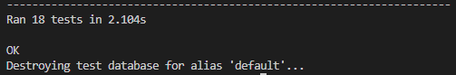
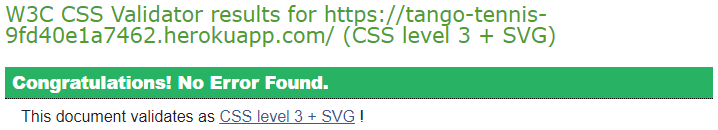
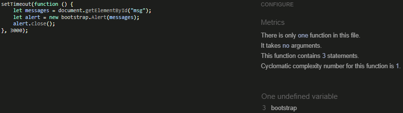
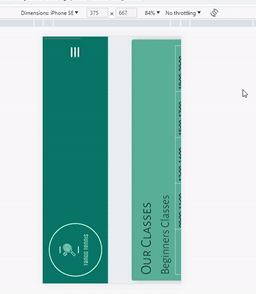
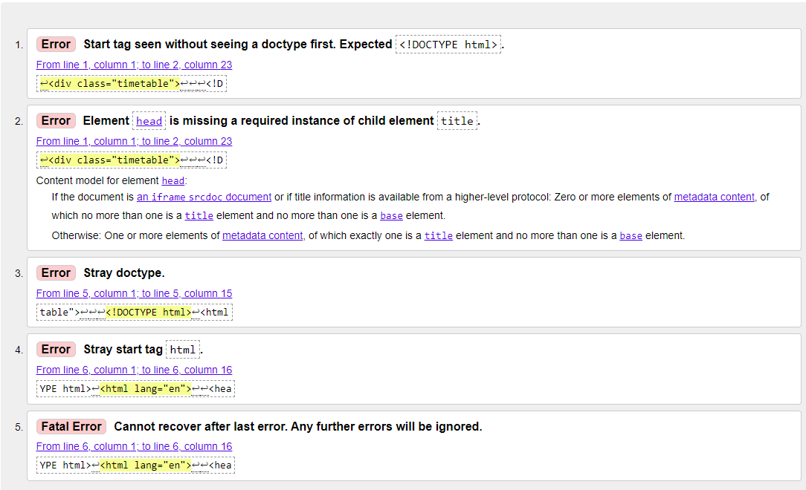

# Testing
### Testing Features
#### Header - General User
| Feature | Expectation | Action | Result |
| ---| ---| ---| ---|
| Logo | Clicking the logo takes the user back to the home page. | Started on Our Classes page. Then clicked the logo. | Taken back to the home page. |
| Home link | Text italicises when hovered over. Clicking it makes the text bold and underlined. Takes user back to Home Page. | Hovered over the link. Then clicked the link. | Text italicised when hovered over. Clicking it made the text bold and underlined. Taken back to Home Page. |
| Our Classes link | Text italicises when hovered over. Clicking it makes the text bold and underlined. Takes user to Our Classes page. | Hovered over the link. Then clicked the link. | Text italicised when hovered over. Clicking it made the text bold and underlined. Taken to Our Classes page. |
| Book Classes link | Text italicises when hovered over. Clicking it takes the user to the Login page. Login link becomes bold and underlined. | Hovered over the link. Then clicked the link. | Text italicised when hovered over. Clicking it took the user to the Login page. Login link became bold and underlined. |
| Register link | Text italicises when hovered over. Clicking it makes the text bold and underlined. Takes user to the Register page.  | Hovered over the link. Then clicked the link. | Text italicised when hovered over. Clicking it made the text bold and underlined. Taken to Register page. |
| Login link | Text italicises when hovered over. Clicking it makes the text bold and underlined. Takes user to the Login page.  | Hovered over the link. Then clicked the link. | Text italicised when hovered over. Clicking it made the text bold and underlined. Taken to Login page. |
#### Header - Signed In User
| Feature | Expectation | Action | Result |
| ---| ---| ---| ---|
| Dropdown menu | Text italicises when hovered over. Clicking it makes the text bold and underlined. Username appears on dropdown menu. Clicking the menu displays the Manage Bookings link, My Reviews link and the logout link. Clicking on Manage Bookings takes the user to the Manage Bookings page. Clicking on My Reviews takes the user to the My Reviews page. Clicking Logout takes the user to the Logout page. | Hovered over the link. Then clicked the link. Clicked Manage Bookings, then My Reviews, then Logout. | Text italicised when hovered over. Clicking it made the text bold and underlined. Username appeared on dropdown menu. Clicking the menu displayed the Manage Bookings link, My Reviews link and the logout link. Clicking on Manage Bookings took the user to the Manage Bookings page. Clicking on My Reviews took the user to the My Reviews page. Clicking Logout took the user to the Logout page. |
#### Header - Staff Member
| Feature | Expectation | Action | Result |
| ---| ---| ---| ---|
| Our Classes Dropdown menu | Text italicises when hovered over. Clicking it makes the text bold and underlined. Clicking the menu displays the Create Classes and View Classes links. Clicking on Create Classes takes the user to the Create Classes page. Clicking on View Classes takes the user to the View Classes page. | Hovered over the link. Then clicked the link. Clicked Create Classes, then View Classes. | Text italicised when hovered over. Clicking it made the text bold and underlined. Clicking the menu displayed the Create Classes and View Classes links. Clicking on Create Classes took the user to the Create Classes page. Clicking on View Classes took the user to the View Classes page. |
#### Footer
| Feature | Expectation | Action | Result |
| ---| ---| ---| ---|
| Social media icons | Clicking each of the icons will open them to their respective websites (Facebook, Instagram or Twitter) in new tabs. | Clicked each of the icons. | Each social media website opened up in a new tab. |
#### Home Page - General User
| Feature | Expectation | Action | Result |
| ---| ---| ---| ---|
| Book your lessons here button | Button changes colour when hovered over. Clicking it takes the user to the Login page. | Hovered over button then clicked it. | Button changed colour when hovered over. Clicking it took the user to the Login page. |
| Take a look at Our Classes button | Button changes colour when hovered over. Clicking it takes the user to the Our Classes page. | Hovered over button then clicked it. | Button changed colour when hovered over. Clicking it took the user to the Our Classes page. |
| Reviews carousel | Arrows highlight slightly when hovered over. Clicking the arrows takes the user through the reviews. | Hovered over the arrows. Clicked on both arrows multiple times. | Arrows highlighted slightly when hovered over. Clicking the arrows took the user through the reviews. |
#### Home Page - Signed In User
| Feature | Expectation | Action | Result |
| ---| ---| ---| ---|
| Book your lessons here button | Button changes colour when hovered over. Clicking it takes the user to the Book Classes page. | Hovered over button then clicked it. | Button changed colour when hovered over. Clicking it took the user to the Book Classes page. |
| Leave a review button | Button changes colour when hovered over. Clicking it takes the user to the Leave a Review page. | Hovered over button then clicked it. | Button changed colour when hovered over. Clicking it took the user to the Leave a Review page. |
| Edit/delete buttons on user's reviews | Buttons only appear on reviews that the user has written. Buttons change colour when hovered over. Edit button takes the user to the Edit your Review page. Delete button takes the user to the Confirm Review Deletion page. | Scrolled through the reviews until one the user had written. Hovered over the buttons then clicked them. | Buttons only appear on reviews that the user had written. Buttons changed colour when hovered over. Edit button took the user to the Edit your Review page. Delete button took the user to the Confirm Review Deletion page. |
#### Home Page - Staff Member
| Feature | Expectation | Action | Result |
| ---| ---| ---| ---|
| Edit/delete buttons on all reviews | Buttons appear on all reviews. Buttons change colour when hovered over. Edit button takes the staff member to the Edit your Review page. Delete button takes the staff member to the Confirm Review Deletion page. | Hovered over the buttons then clicked them. | Buttons appear on all reviews. Buttons changed colour when hovered over. Edit button took the staff member to the Edit your Review page. Delete button took the staff member to the Confirm Review Deletion page. |
#### Our Classes Page -  Staff Member
| Feature | Expectation | Action | Result |
| ---| ---| ---| ---|
| Edit/delete buttons next to all classes | Buttons appear next to all classes. Buttons change colour when hovered over. Edit button takes the staff member to the Edit Lesson page. Delete button takes the staff member to the Confirm Lesson Deletion page. | Hovered over the buttons then clicked them. | Buttons appear next to all classes. Buttons changed colour when hovered over. Edit button took the staff member to the Edit Lesson page. Delete button took the staff member to the Confirm Lesson Deletion page. |
| Edit lesson | Changing any of the options will result in that particular class being updated in the timetable. Edit lesson button changes colour when hovered over. | Changed the time of the Monday beginners lesson from morning, early afternoon, late afternoon and evening to just evening. Then pressed Edit Lesson. | Edit Lesson button changed colour when highlighted over. The lesson reappeared in the timetable with just evening highlighted. |
| Delete lesson | Deleting a lesson will result in that particular class being deleted from the timetable. Delete lesson button and Confirm button change colour when hovered over. | Deleted the Monday beginners class. | Delete Lesson button and Confirm button changed colour when highlighted over. The lesson was removed from the timetable. |
| Cancel button | Button changes colour when hovered over. Clicking it will take the user back to the Our Classes page. | Hovered over the Delete button then clicked it. Then clicked the Cancel button. | Button changed colour when hovered over. Clicking it took the user back to the Our Classes page. |
#### Book Classes Page - Signed In User
| Feature | Expectation | Action | Result |
| ---| ---| ---| ---|
| No date input | Clicking Book Class button will result in a warning message appearing informing the user to fill in the date field. | Clicked Book Class. | Received a message informing the user to fill in the date field. |
| Date in the past | Clicking Book Class button will result in a warning message appearing informing the user to choose a future date. | Selected the date 25/12/22. | Received a message informing the user to choose a future date. |
| Same date as another user | Clicking Book Class button will result in a warning message appearing informing the user that this class has already been booked. The message will also state which level of class the user tried to book. | Selected the same level, date and time as a previously booked class. | Received a message informing the user that this beginners class has already been booked. |
| Successful booking | Clicking Book Class will take the user to the Manage Bookings page. The classes will be ordered with the most recent date at the top. A green success message will appear at the top of the page informing the user of the successful booking. This message will disappear automatically after 3 seconds. | Booked a valid class. | Taken to the Manage Bookings page. The classes are ordered with the most recent date at the top. A green success message appeared at the top of the page informing the user of the successful booking. This message disappeared automatically after 3 seconds. |
#### Register Page - General User
| Feature | Expectation | Action | Result |
| ---| ---| ---| ---|
| No inputs | Clicking Sign up will result in a message informing the user to fill in the username field. | Clicked Sign up. | Message appeared informing the user to fill in the username field. |
| Incorrectly inputted email address | Clicking Sign up will result in a message informing the user to correctly input their email address. | Inputted the username Bob and email of bob. | Message appeared informing the user to input their email address correctly with the @ symbol. |
| No password | Clicking Sign up will result in a message informing the user to fill in the password field. | Inputted a username and email address but no password. | Message appeared informing the user to fill in the password field. |
| Insufficient password | Clicking Sign up will result in a message informing the user that their password needs to be changed to meet the specified requirements. | Inputted the password 123. | Message appeared informing the user that the password was too short, was too common and only had numeric values.|
| Non-matching passwords | Clicking Sign up will result in a message informing the user that they must type the same password each time. | Inputted the password Password975 then the password Password987. | Message appeared informing the user that they must type the same password each time. |
| Successful Sign Up | Clicking Sign up will take the user to the Home page. A green success message appears informing the user of the successful sign in. This message will disappear automatically after 3 seconds. Navbar changes to that of a signed in user. | Clicked Sign up. | Taken to the Home page. A green success message appeared informing the user of the successful sign in. This message disappeared automatically after 3 seconds. Navbar changed to that of a signed in user. |
| Sign in link | Clicking the sign up link takes the user to the Login page. | Clicked the sign up link. | Taken to the Login page. |
#### Login Page
| Feature | Expectation | Action | Result |
| ---| ---| ---| ---|
| No inputs | Clicking Sign in will result in a message informing the user to fill in the username field. | Clicked Sign in. | Message appeared informing the user to fill in the username field. |
| No password | Clicking Sign in will result in a message informing the user to fill in the password field. | Inputted a username but no password. | Message appeared informing the user to fill in the password field. |
| Incorrect password | Clicking Sign in will result in a message informing the user that the username and/or password is not correct. | Inputted the incorrect password. | Message appeared informing the user that the username and/or password was not incorrect. |
| Successful Sign In | Clicking Sign in will take the user to the Home page. A green success message appears informing the user of the successful sign in. This message will disappear automatically after 3 seconds. Navbar changes to that of a signed in user. | Clicked Sign in. | Taken to the Home page. A green success message appeared informing the user of the successful sign in. This message disappeared automatically after 3 seconds. Navbar changed to that of a signed in user. |
| Sign up link | Clicking the sign up link takes the user to the Register page. | Clicked the sign up link. | Taken to the register page. |
#### Manage Bookings Page - Signed In User
| Feature | Expectation | Action | Result |
| ---| ---| ---| ---|
| Edit/delete buttons next to all bookings | Buttons appear next to all bookings. Buttons change colour when hovered over. Edit button takes the user to the Edit your Class page. Delete button takes the user to the Confirm Booking Deletion page. | Hovered over the buttons then clicked them. | Buttons appear next to all bookings. Buttons changed colour when hovered over. Edit button took the user to the Edit your Class page. Delete button took the user to the Confirm Booking Deletion page. |
| Edit your Lesson | Changing any of the options will result in that particular class being updated in the Manage Bookings page. Update class button changes colour when hovered over. | Changed the level from beginners to advanced and changed the time from 09:00-11:00 to 18:00-20:00. Then pressed Update class. | Update class button changed colour when highlighted over. The class reappeared in the Manage Bookings page with the information updated. |
| Delete booking  | Deleting a booking will result in that particular class being deleted from the Manage Bookings page. Confirm button changes colour when hovered over. | Deleted a booking. | Confirm button changed colour when highlighted over. The booking was removed from the Manage Bookings page. |
| Cancel button | Button changes colour when hovered over. Clicking it will take the user back to the Manage your Bookings page. | Hovered over the Cancel button then clicked it. Then clicked the Cancel button. | Button changed colour when hovered over. Clicking it took the user back to the Manage your Bookings page. |
| No classes booked - 'here' link | Clicking the link will take the user to the Book Classes page. | Clicked the link. | Taken to the Book Classes page. |
#### Manage Bookings Page - Staff Member
| Feature | Expectation | Action | Result |
| ---| ---| ---| ---|
| Staff Manage Bookings page | Staff members can see all bookings, the usernames of who booked the classes, the booking references, and edit/delete buttons for all bookings. | Accessed the Manage Bookings page through the staff login. | Staff members could see all bookings, the usernames of who booked the classes, the booking references, and edit/delete buttons for all bookings. |
#### My Reviews Page - Signed In User
| Feature | Expectation | Action | Result |
| ---| ---| ---| ---|
| Edit/delete buttons underneath all reviews  | Buttons appear underneath all reviews. Buttons change colour when hovered over. Edit button takes the user to the Edit your Review page. Delete button takes the user to the Confirm Booking Review page. | Hovered over the buttons then clicked them. | Buttons appear underneath all reviews. Buttons changed colour when hovered over. Edit button took the user to the Edit your Review page. Delete button took the user to the Confirm Review Deletion page. |
| Edit your Review | Changing any of the text will result in that updated review reappearing on the Home page in the reviews section. It will be then be the first review to appear in the carousel. Update button changes colour when hovered over. | Changed some of the text in an existing review. Then pressed Update. | Update button changed colour when highlighted over. The review reappeared in the reviews section of the Home page with the review updated. |
| Delete review  | Deleting a review will result in that particular review being deleted from the my Reviews page and from the reviews carousel. Confirm button changes colour when hovered over. | Deleted a review. | Confirm button changed colour when highlighted over. The review was removed from the My Reviews page and from the reviews carousel. |
| Cancel button | Button changes colour when hovered over. Clicking it will take the user back to the My Reviews page. | Hovered over the Cancel button then clicked it. Then clicked the Cancel button. | Button changed colour when hovered over. Clicking it took the user back to the My Reviews page. |
| Leave a review button | Button changes colour when hovered over. Clicking it takes the user to the Leave a Review page. | Hovered over button then clicked it. | Button changed colour when hovered over. Clicking it took the user to the Leave a Review page. |
#### Leave a Review Page - Signed In User
| Feature | Expectation | Action | Result |
| ---| ---| ---| ---|
| No inputs | Clicking Submit will result in a message informing the user to fill in the name field. | Clicked Submit. | Message appeared informing the user to fill in the name field. |
| No review | Clicking Submit will result in a message informing the user to fill in the review field. | Clicked Submit. | Message appeared informing the user to fill in the review field. |
| Review max length | User will be prevented from typing a review longer than 350 characters and will receive a message informing them if they have entered a review that is too long. | Typed a review of 351 characters. | Prevented from typing a review longer than 350 characters. Received a message informing the user that this is longer than 350 characters. |
| Successful review | Clicking Submit will take the user to the Home page. A green success message appears informing the user of the successful review. This message will disappear automatically after 3 seconds. Review will be added to the reviews carousel and to the My Reviews page. | Wrote a review and clicked Submit. | Taken to the Home page. A green success message appeared informing the user of the successful sign in. This message disappeared automatically after 3 seconds. Review was added to the reviews carousel and to the My Reviews page. |
#### My Reviews Page - Staff Member
| Feature | Expectation | Action | Result |
| ---| ---| ---| ---|
| Staff reviews page | Staff members can see all reviews, the usernames of who wrote the reviews and edit/delete buttons for all reviews. | Accessed the My Reviews page through the staff login. | Staff members could see all reviews, the usernames of who wrote the reviews and edit/delete buttons for all reviews. |
#### Logout Page
| Feature | Expectation | Action | Result |
| ---| ---| ---| ---|
| Sign out button | Button changes colour when hovered over. Clicking it will take the user back to the Home page. Success message appears at the top of the screen informing the user that they have signed out. Message disappears automatically after 3 seconds. | Clicked Sign out. | Button changed colour when hovered over. Clicking it took the user back to the Home page. Success message appeared at the top of the screen informing the user that they have signed out. Message disappeared automatically after 3 seconds. |
#### Create Classes Page - Staff Member
| Feature | Expectation | Action | Result |
| ---| ---| ---| ---|
| Add a lesson | Add lesson button changes colour when hovered over. Clicking this button will take the staff member to the View Classes page where they will see the lesson added to the correct table in the timetable. | Added a lesson. | Add lesson button changed colour when hovered over. The added lesson appeared in the timetable. |
### Testing User Stories
EPIC: Booking classes
- As a registered user I want to be able to book a class, so that I can be added to the tennis lesson
    - Result: Signed in users have the ability to book a class
- As a registered user I want to be able to view all of my booked classes, so that I can amend them if necessary
    - Result: Signed in users are able to view their bookings in the Manage your Bookings page
- As a registered user I want to be able to edit my booked classes, so that I can amend them if necessary
    - Result: Signed in users are able to edit their booked classes through the Manage your Bookings page
- As a registered user I want to be able to delete my booked classes, if I can no longer attend
    - Result: Signed in users are able to delete their booked classes through the Manage your Bookings page
- As a registered user I want to receive feedback when creating, editing or deleting a class, so that I can clearly see what I have done
    - Result: Signed in users will be presented with green success messages for completing these actions

EPIC: Registration and User Accounts
- As a new user, I want to navigate to the sign up page, so that I can create an account
    - Result: General users can create an account through the sign up page
- As a registered user, I want to login to my account, so that I can make and update bookings
    - Result: Registered users can login to their accounts
- As a registered user, I want to log out of my account, so that I can protect my information from being accessed by others
    - Result: Signed in users can log out of their accounts
- *As a registered user, I want to be able to edit my account details, so that I can make changes if needed - **could have***
    - Result: This user story has not been completed due to time constraints, however, it does not affect the usability of the website and has been added to the list of future features
- *As a registered user, I want to be able to delete my account, if I no longer want to be signed up to Tango Tennis - **could have***
    - Result: This user story has not been completed due to time constraints, however, it does not affect the usability of the website and has been added to the list of future features

EPIC: Viewing the features of Tango Tennis
- As a general user, I want to see clearly laid out information about Tango Tennis, so that I can see what they have to offer
    - Result: General users can see the home page with clear information about what Tango Tennis offers
- As a general user, I want to see a clearly structured navbar and footer, so that I can see what will be featured on the site and can access Tango Tennis' social media links easily
    - Result: The navbar and footer have been created so that they are easy to navigate for general users
- As a general user, I want the website to be responsive, so that I can access it on a range of devices
    - Result: The website is responsive and so can be accessed on mobile devices, tablets, laptops and desktops
- *As a general user, I want to have access to Tango Tennis' contact information, so that I can pass on any queries I have - **could have***
    - Result: This user story has not been completed due to time constraints, however, it does not affect the usability of the website and has been added to the list of future features

EPIC: Reviewing classes
- As a registered user, I want to be able to review my classes, so that I can give feedback
    - Result: Signed in users can leave reviews
- As a general user, I want to be able to see reviews for the different classes and coaches, so that I can see which are rated highly
    - Result: General users can see reviews presented as a carousel on the home page
- As a registered user, I want to be able to edit my reviews, so that I can make any adjustments if needed
    - Result: Signed in users can edit their own reviews either through the My Reviews page or directly on the reviews carousel
- As a registered user, I want to be able to delete my reviews, if I no longer want to leave that review.
    - Result: Signed in users can delete their own reviews either through the My Reviews page or directly on the reviews carousel

EPIC: Administrative Managing of Classes
- As an admin member, I want to create tennis lessons for the different levels, so that I can provide a clear timetable of our classes
    - Result: Staff members are able to create class timetables
- As an admin member, I want to view how many people have booked classes, and the dates and times of bookings, so that I can keep track of all upcoming bookings
    - Result: Staff members are able to view who has booked classes and when they will be through the Manage Bookings page
- As an admin member, I want to be able to edit the lesson timetables, so that I can update them as necessary
    - Result: Staff members are able to edit the lesson timetables through the View Classes page
- As an admin member, I want to be able to delete lessons, so that I can they do not appear in the timetable when the timetable needs to change
    - Result: Staff members are able to delete lessons through the View Classes page

 **NB:** As mentioned in the future features section, the ability to link the lesson timetable to the booking form is something that needs to be worked on to make a fully functional, more advanced website, however, the foundations for this have all been laid out as can be seen above.
### Responsiveness
- The website has been tested on Chrome, Edge and Firefox as well as on an iPhone 11, iPhone 13 mini, Samsung Galaxy S22, and iPad 6th Generation in order to check the responsiveness on different devices and different browsers.
- The responsiveness of each page of the website has also been tested using Chrome Developer tools to ensure that the website maintains a clear display across all screen sizes from 320px upwards.
### Browser Compatability
- The website has been tested on Chrome, Firefox and Edge to ensure that it functions on a range of browsers.
### Accessiblity
- The website has been passed through [WAVE](https://wave.webaim.org/) to check the accessibility of the site.
- Originally there were errors to do with the contrast on the Our Classes page and on all the forms due to the light grey font colour being challenging to read on the light teal background. This was amended by changing the font colour to black which removed these errors.
- There were alerts mentioned on all of the pages about a redundant link but this is because in the header the logo and the Home button both take the user back to the Home page.
- There were also errors on the Our Classes page due to their being 3 empty table headers, however, after adding aria-labels to these cells, the errors were resolved.
### Lighthouse Testing
**Desktop**
| Page | Performance | Accessibility | Best Practices | SEO |
| ---| ---| ---| ---| ---|
| Home | 94 | 100 | 100 | 91 |
| Our Classes | 99 | 100 | 100 | 91 |
| Register | 97 | 100 | 100 | 91 |
| Login | 100 | 100 | 100 | 91 |
| Book Classes | 99 | 100 | 100 | 91 |
| Manage Bookings | 99 | 100 | 100 | 91 |
| My Reviews | 99 | 100 | 100 | 91 |
| Leave a Review | 99 | 100 | 100 | 91 |
| Edit Class | 95 | 100 | 100 | 91 |
| Delete Class | 95 | 100 | 100 | 91 |
| Logout | 99 | 100 | 100 | 91 |
| Add Lesson | 95 | 100 | 100 | 91 |
| Edit Lesson | 96 | 100 | 100 | 91 |
| Delete Lesson | 99 | 100 | 100 | 91 |

**Mobile**
| Page | Performance | Accessibility | Best Practices | SEO |
| ---| ---| ---| ---| ---|
| Home | 79 | 100 | 100 | 92 |
| Our Classes | 93 | 100 | 100 | 92 |
| Register | 95 | 100 | 100 | 92 |
| Login | 95 | 100 | 100 | 92 |
| Book Classes | 89 | 100 | 100 | 92 |
| Manage Bookings | 94 | 100 | 100 | 90 |
| My Reviews | 95 | 100 | 100 | 92 |
| Leave a Review | 93 | 100 | 100 | 92 |
| Edit Class | 93 | 100 | 100 | 92 |
| Delete Class | 93 | 100 | 100 | 91 |
| Logout | 92 | 100 | 100 | 92 |
| Add Lesson | 94 | 100 | 100 | 92 |
| Edit Lesson | 95 | 100 | 100 | 92 |
| Delete Lesson | 94 | 100 | 100 | 92 |
### Unit Tests
- Unit tests were carried out to check the basic functionality of the home, lessons, and bookings views.
- These tests check that the correct templates are rendered and also tests some redirects.
- To perform these tests enter the following command into the terminal:
    - python3 manage.py test --settings=tangotennis.settings_test
- The results can be seen below:


### Code Validation
#### HTML
- All pages were passed through the [W3C HTML Validator](https://validator.w3.org/) and any errors that were found were corrected so none of the pages are showing any warnings or errors.
- Because of Django's templating language, the files could not be copied and pasted into the validator. Instead, the code validation was checked by right clicking on the page, viewing the page source and copying this into the validator.
#### CSS
- The site was passed through the [W3C CSS Validator](https://jigsaw.w3.org/css-validator/) and no errors were found.


#### JavaScript
- JavaScript code was passed through [JSHint](https://jshint.com/) and the only issue it raised was that in the base.html file bootstrap was an undefined variable. As the JavaScript here was actually referring to Bootstrap Alerts, and I was assigning a new Bootstrap alert to the existing alert, I thought I could ignore this warning.



- The other piece of JavaScript in this project was in the our_classes.html file, and the only issues that came up were missing semicolons, which I amended.

#### Python
- All python files were passed through the [CI Python Linter](https://pep8ci.herokuapp.com/#). 
- The main error that was reported was that there was no new line at the end of one of the files but this was quickly amended.
- The only remaining file with some lines that are too long is the settings.py file due to the AUTH_PASSWORD_VALIDATORS being too long.
### Bugs
#### Solved Bugs
- I had an incorrect file path for the add_lessons.html file as I was receiving the error that the template did not exist.
    - Solution: I had to add the add_lessons.html file to a lessons folder within the templates folder in the lessons app.
- I had an incorrect success url for adding a lesson which was leading to a 404 error.
    - Solution: I had to correct the url from /our_classes to /lessons/our_classes.
- When adding lessons to the timetable, the days were appearing in alphabetical order instead of in order of the days of the week.
    - Solution: I edited the lessons model to make the DAY choice fields integers from 1-7 so that they would be ordered correctly on the timetable.
    - I then tried migrating the new model but ran into a new error that it could not migrate correctly, so I had to delete all the migration files and reset the database on ElephantSQL.
    After doing this and resetting the superuser, everything worked as intended.
- I was getting a type error when a non-signed in user adds /bookings/manage_bookings/ or /my_reviews to the home page url.
    - Solution: I had to add the LoginRequiredMixin to the BookingsList and MyReviews view.py files so that only logged in users can reach those pages and non-signed in users are redirected to the login page.
- I had an issue where any signed in users could add lessons to the Create Lessons page if they inputted /lessons/add_lessons to the home page url.
    - Solution: I added the UserPassesTestMixin to the AddLessons view so that only staff members can access this page other users would be shown the 403 page.
#### Unsolved Bugs
- On the Our Classes page there is a horizontal scroll on mobile devices. I attempted to solve this by following what I had read [here](https://stackoverflow.com/questions/14360581/force-landscape-orientation-mode#:~:text=lock('landscape')%3B,and%20stay%20in%20landscape%20mode) on Stack Overflow. I added the class timetable to the Our Classes table-responsive div and then added the following code to my css file: 
```
@media screen and (min-width: 280px) and (max-width: 470px) and (orientation: portrait) {
    .timetable {
      transform: rotate(-90deg);
      transform-origin: left top;
      width: 100vh;
      height: 100vw;
      overflow-x: hidden;
      position: absolute;
      top: 100%;
      left: 0;
    }
  }
```
This did rotate the Our Classes timetable however, the header and footer were not rotated alongside this. To try and fix this I created a div at the top of the our_classes.html file and gave it the class of timetable instead and wrapped everything in the file inside this div. This did produce the desired outcome as can be seen below:



However, when I checked the HTML of this page I received the following errors:

This was because of the timetable div wrapping the entire page and as I could not find a solution to this I decided to leave the Our Classes page as it originally was with the horizontal scroll.

- I originally created the home app to just render the home page index.html template, but I later decided to add the reviews functionality to my website. Because the reviews are rendered on the home page, I made the model, views and form for this within the home app as I initially thought this made sense as this was all to display on the same page. However, after a discussion with my mentor it was agreed that the reviews functionality should be contained within its own app so there should a separate home app and reviews app. Unfortunately, due to time constraints I was unable to separate the home app into two to have the reviews as its own app, but this is something I'd look to implement going forwards.
- As I have mentioned in the future features section, currently the add lessons functionality does not correlate to the booking form, meaning that if a staff member decides that there will only be one beginners class on a Monday, this will not be reflected in the booking form. This is something that I would really like to implement, but due to my current level of knowledge I was unable to do so at the moment. Therefore, to ensure that the booking form makes sense with regards to the lesson timetable, there are currently lessons everyday at all of the time slots.